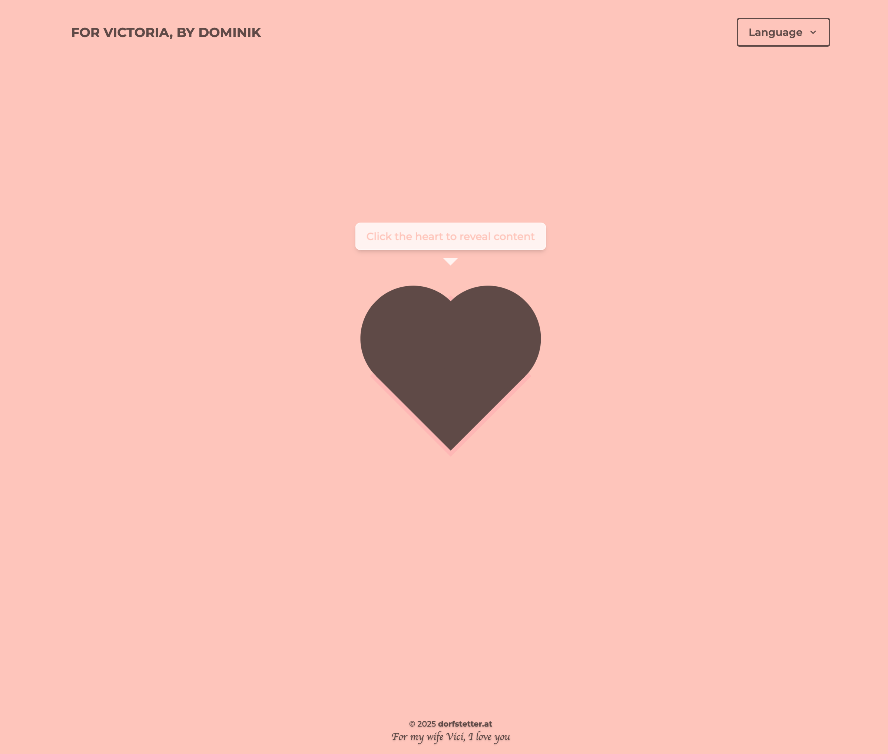
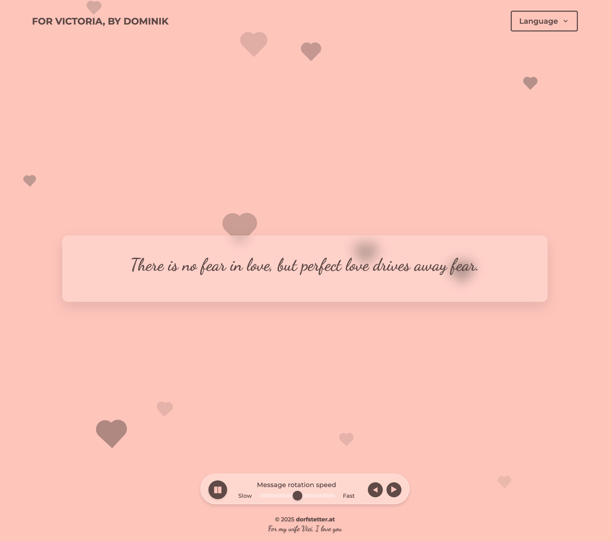

# For My Love Svelte

A beautiful interactive web application that displays love messages and greetings in a visually appealing way. The app features animated 2D hearts, interactive animations, and rotating messages in multiple languages.

## Live Demo

Visit the live application at [https://iheartvici.surge.sh](https://iheartvici.surge.sh)

## Features

- 2D animated hearts with CSS animations
- Internationalization (i18n) with support for English, German, and Spanish
- Interactive animations and transitions
- Rotating messages and greetings
- Responsive design that works on all devices
- Accessibility features for users with disabilities
- Dark/light mode compatibility
- High contrast mode support

## Screenshots

### Initial View


### After Interaction


## Technology Stack

- [Svelte 5.28.2](https://svelte.dev/) - A modern JavaScript framework with runes mode enabled
- [TypeScript 5.8.3](https://www.typescriptlang.org/) - For type safety
- [TailwindCSS 3.4.17](https://tailwindcss.com/) - For styling
- [PostCSS](https://postcss.org/) - For CSS processing
- [svelte-i18n](https://github.com/kaisermann/svelte-i18n) - For internationalization
- [Rollup 4.40.1](https://rollupjs.org/) - For bundling

## Svelte 5 Runes

This project uses Svelte 5's new runes mode, which introduces a new reactive programming model:

- `$state` - For declaring reactive state variables
- `$derived` - For computed values that depend on state
- `$effect` - For side effects that run when dependencies change

Example usage in the project:

```svelte
<script>
  // Declare reactive state
  let appLanguage = $state('de');

  // Derived value that updates when appLanguage changes
  let appTitle = $derived($_('title'));

  // Effect that runs when dependencies change
  $effect(() => {
    if (appLanguage && appTitle) {
      updateMetaTags();
    }
  });
</script>
```

## Getting Started

### Prerequisites

- [Node.js](https://nodejs.org/) (LTS version recommended)
- npm (comes with Node.js)

### Installation

1. Clone the repository
   ```bash
   git clone https://github.com/yourusername/for-my-love-svelte.git
   cd for-my-love-svelte
   ```

2. Install dependencies
   ```bash
   npm install
   ```

### Development

Start the development server:

```bash
npm run dev
```

This will start a development server at [localhost:5000](http://localhost:5000). The page will automatically reload when you make changes to the source files.

### Allow Connections from Other Devices

To allow connections from other computers on your network (useful for testing on mobile devices):

```bash
npm run dev -- --host
```

### Type Checking

Run TypeScript type checking:

```bash
npm run check
```

## Building for Production

Create an optimized production build:

```bash
npm run build
```

### Testing the Production Build Locally

After building, you can preview the production build with:

```bash
npm run start
```

### Deployment

Deploy to [Surge.sh](https://surge.sh):

```bash
npm run publish
```

This will build the project and deploy it to [iheartvici.surge.sh](https://iheartvici.surge.sh).

## Project Structure

- `public/` - Static assets and build output
- `src/` - Source code
  - `_layout.svelte` - Layout component
  - `App.svelte` - Main application component
  - `Heart.svelte` - 2D hearts animation with CSS
  - `ContentCard.svelte` - Message display component
  - `Navigation.svelte` - Language selection and navigation
  - `i18n.ts` - Internationalization setup
  - `global.d.ts` - TypeScript declarations
  - `lang/` - Translation files
    - `de.json` - German translations
    - `en.json` - English translations
    - `es.json` - Spanish translations
  - `content.model.ts` - Type definitions for content
  - `main.ts` - Application entry point

## How It Works

The application features an interactive experience:

1. Initially, animated 2D hearts are displayed with a click hint
2. When the user clicks the heart, animated overlays move away to reveal content
3. A card shows rotating messages including love notes and greetings
4. Users can pause the rotation, adjust speed, and switch languages
5. The app automatically adapts to screen size, contrast preferences, and reduced motion settings

## Customization

### Adding New Messages

Add new messages or greetings by editing the language files in `src/lang/`:

```
// Example addition to en.json
{
  "wishes": [
    // ... existing messages
    {
      "id": 17,
      "text": "Your new message here"
    }
  ]
}
```

### Creating Translations

To add a new language, create a new file in the `src/lang/` directory following the structure of the existing language files, and update the language selector in `Navigation.svelte`.

## Browser Support

The application supports all modern browsers:

- Chrome/Edge (latest)
- Firefox (latest)
- Safari (latest)
- Mobile browsers

## License

This project is licensed under the MIT License - see the [LICENSE](LICENSE) file for details.

## Acknowledgments

- Special thanks to Victoria, the inspiration for this project
